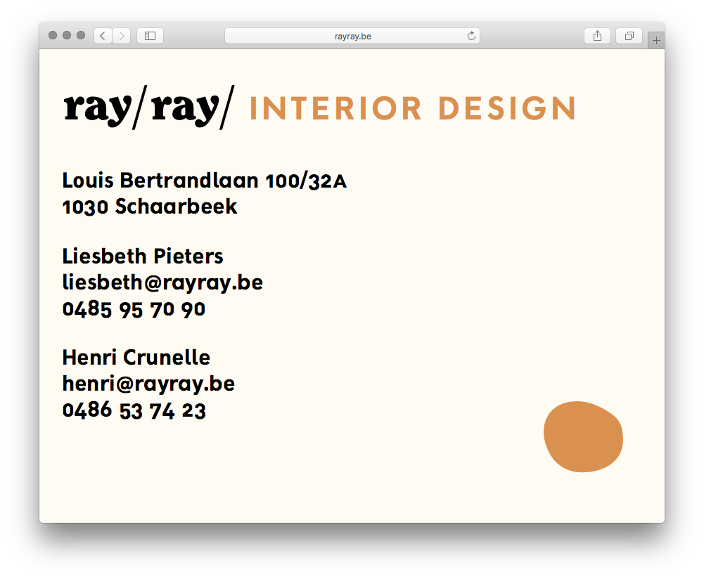
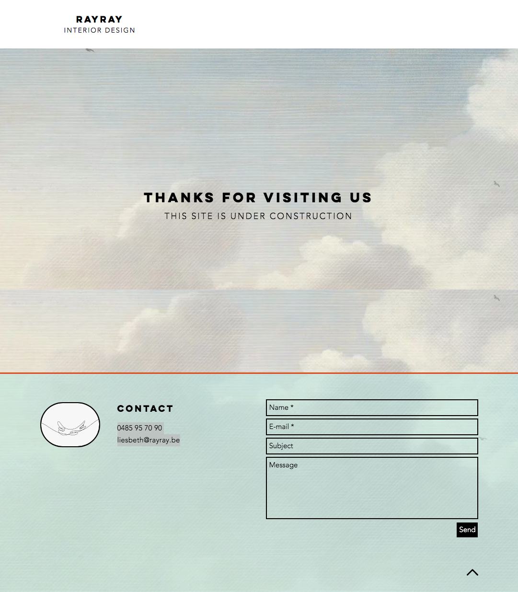

# ray/ray/ Website (rayray.be)

This repository contains both development and production files to the website on [rayray.be](http://www.rayray.be).

- source files are in [`/development`](development/)
- optimized production files which have actually been deployed are in [`/production`](production/) (these are the files that are publicly online and make up the website)

### Visual timeline

Screengrabs of the website’s former appearances are put in `/archive`.

)](archive/2020-09-18-212231.png)

 or on -->[archive.today](https://archive.vn/1xZk9))](archive/2020-09-13-211847.png)

 or on [archive.today](https://archive.fo/BvpjO))](archive/2020-09-10-150657.png)

